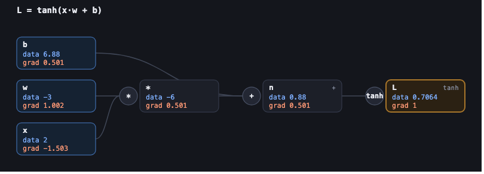
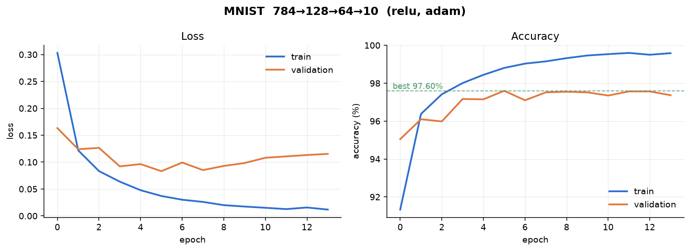

<div align="center">

# ∇ nabla

**An automatic differentiation engine built from scratch, and a neural network trained with it to 97.63% on MNIST.**

No PyTorch. No TensorFlow. No JAX. The computational graph, the backward pass,
the neural network, the optimisers and the training loop are all implemented
here, from the mathematics up.

[](https://github.com/Adebayodamilola20/autograd-engine/actions/workflows/tests.yml)
[](docs/14-mnist.md)
[](docs/06-gradient-checking.md)
[](https://github.com/Adebayodamilola20/autograd-engine/actions/workflows/tests.yml)
[](LICENSE)

</div>

---

```python
from nabla import Value

a = Value(2.0, label='a')
b = Value(3.0, label='b')
d = a * b + a

d.backward()

a.grad    # 4.0   =  b + 1
b.grad    # 2.0   =  a
```

Three lines of arithmetic build a graph. `backward()` walks it in reverse
topological order, multiplying local derivatives, and every leaf ends up holding
its partial derivative of the output.

Scale that to 109,386 parameters and you have a network that reads handwriting.



*Every node stores its value, its gradient, and how it was computed. This is what
`.backward()` actually operates on.*

---

## Why I built this

I could train models. I could not have told you what `loss.backward()` did.

That gap bothered me, so I closed it the only way that reliably works: build the
thing. The rule for the whole project was that **anything I could not derive, I
could not implement** — every backward rule in this repository is derived in the
docs before it appears in the code, and then checked numerically against finite
differences.

The result is a working autodiff engine, and the ability to explain every step
between "here is an image" and "here is a trained classifier".

## Results

| | |
|---|---|
| **MNIST test accuracy** | **97.63%** (9,763 / 10,000 unseen digits) |
| Architecture | 784 → 128 → 64 → 10, ReLU |
| Parameters | 109,386 |
| Training time | 16.3 s, 14 epochs |
| Tests | 737, including 183 finite-difference gradient checks |
| Reproducible | seed 0 — identical result every run |

<div align="center">



</div>

**The mistakes are the interesting part:**

```
4 misread as 9:   25 times      3 misread as 9:   11 times
2 misread as 7:   10 times      5 misread as 3:    8 times
```

These are not random. 4/9 differ only by whether the top closes; 7/2 share a
horizontal stroke; 3/5 share an open right side. The model is failing on
**genuinely ambiguous pairs** — the signature of something that learned about
shape rather than memorising. A uniformly scattered confusion matrix would be far
more worrying.

## Try it

<div align="center">


</div>

```bash
python examples/train_mnist.py     # train it — 16 seconds
python web/server.py               # then draw a digit at http://127.0.0.1:8000
```

The demo shows the prediction, the full class distribution, and **live per-layer
activations** — including the ~50% of hidden units that go silent on any given
digit. That is ReLU, made visible.

---

## What automatic differentiation is

Three ways to get a derivative:

| approach | how | problem |
|---|---|---|
| **Symbolic** | manipulate the formula (like Mathematica) | expression swell — the derivative can be exponentially larger than the function |
| **Numerical** | $\frac{f(x+h)-f(x-h)}{2h}$ | approximate, and needs **2 evaluations per parameter** — 218,772 for our network |
| **Automatic** | apply the chain rule to the *execution trace* | exact to machine precision, **one** backward pass for all parameters |

Automatic differentiation is neither of the first two. It exploits the fact that
every program, however complicated, is a composition of elementary operations
whose derivatives we know. Record what actually ran, then apply the chain rule to
that record.

**Reverse mode** works backwards from the output. That direction matters
enormously: a loss function has **many inputs and one output**, and reverse mode
computes one *row* of the Jacobian per sweep. For a scalar output there is only
one row, so a single sweep gives all 109,386 partial derivatives.

Forward mode would need 109,386 sweeps. This asymmetry — the **cheap gradient
principle** — is why deep learning is computationally possible at all.

## How backpropagation works

The entire algorithm:

```python
def backward(self):
    order = topological_sort(self)      # 1. parents before children

    for node in order:                  # 2. clear intermediates
        if node._prev:
            node.reset_grad()

    self.grad += 1.0                    # 3. ∂L/∂L = 1

    for node in reversed(order):        # 4. walk consumers-first
        node._backward()                # 5. each applies its local rule
```

Six lines. Everything else in this repository is built on them.

Two guarantees make it correct on any graph:

- **Reverse topological order** ensures a node's gradient is *complete* before it
  is used.
- **Accumulation** (`+=`, never `=`) ensures it *collected everything* — when a
  value is used on several paths, the multivariable chain rule says those
  contributions sum.

That second one is the classic bug, and it is invisible on any expression where
each variable appears exactly once.

**Worked example.** For `L = (x·y + b)²` at `x=2, y=3, b=1`:

| node | rule | result |
|---|---|---|
| `L` | `pow`: ∂L/∂s = 2s | `s.grad = 14` |
| `s` | `add` passes through | `p.grad = 14`, `b.grad = 14` |
| `p` | `mul` swaps operands | `x.grad = 42`, `y.grad = 28` |

Analytically: ∂L/∂x = 2(xy+b)·y = 42 ✓, ∂L/∂y = 2(xy+b)·x = 28 ✓.

## What's implemented

**The engine** — `Value` with `+ - * / ** neg exp log tanh sigmoid relu`, every
derivative derived and gradient-checked. Iterative topological sort (recursion
overflows at our depth of 1,000). Full `backward()` with correct accumulation.

**Verification** — finite-difference gradient checking with central differences,
183 checks covering every operator, activation, loss and full-network parameter
gradient.

**Visualisation** — SVG renderer with **zero dependencies** (a from-scratch
project should not require Graphviz to draw its own graphs), plus a DOT exporter
when Graphviz is available.

**Neural networks** — `Module`, `Parameter`, `Neuron`, `Layer`, `MLP`, with
He/Xavier/LeCun initialisation selected automatically from the activation.

**Losses** — MSE, MAE, and softmax cross-entropy with **log-sum-exp
stabilisation**, so overflow is impossible by construction rather than merely
unlikely.

**Optimisers** — SGD, momentum, Adam with bias correction, AdamW, gradient
clipping.

**Training** — epochs, batching, stratified validation split, metrics,
checkpointing (model *and* optimiser state), early stopping, LR schedules.

**A tensor engine** — the same reverse-mode algorithm where a node is an array
instead of a float. Broadcasting, reductions, matmul, reshape, transpose.

## Why frameworks are built around tensors

This turned out to be the most interesting result in the project.

| engine | forward + backward, per sample | vs the next |
|---|---|---|
| our scalar `Value` engine | 1.68 s | — |
| our tensor engine | 6.6 µs | **~254,000× faster** |
| PyTorch | 4.7 µs | 1.4× faster |

Read that twice. The step from **our scalar engine to our tensor engine** is
~254,000×. The step from our tensor engine to **PyTorch** — thousands of
contributors, hand-tuned kernels, a C++ core — is about 1.4×.

The cause is granularity. One MNIST sample on the scalar engine builds a graph
of **328,804 nodes**. The tensor engine computes the same gradients for a batch
of 64 in **33 nodes**.

So the answer to *"why are frameworks built around tensors?"* is not that tensors
are mathematically necessary — our scalar engine computes identical gradients.
It is that **the unit of work has to be big enough that per-operation interpreter
overhead stops mattering.**

### Measured against PyTorch

Same architecture, same parameter count (verified equal), same batch size, same
optimiser, **float64 and single-threaded on both sides** — the comparison least
flattering to us.

| operation | nabla | PyTorch | PyTorch faster by |
|---|---|---|---|
| forward (batch of 64) | 118 µs | 91 µs | 1.3× |
| forward + backward | 424 µs | 302 µs | 1.4× |
| full training step | 882 µs | 609 µs | 1.4× |
| **one MNIST epoch** | 161 ms | 89 ms | **1.8×** |
| inference over test set | 4.6 ms | 2.1 ms | 2.2× |

*Measured on one machine; `python benchmarks/compare.py` regenerates this table
and [docs/18-performance.md](docs/18-performance.md) from scratch. Run-to-run
variation is a few tenths on the ratios.*

Accuracy after one epoch: **91.5% (ours) vs 89.8% (PyTorch)** — close enough to
confirm both are solving the same problem, which is what makes the timings mean
anything.

**Why PyTorch is faster:** no Python object per graph node; fused kernels
(`F.cross_entropy` computes `p − y` in one pass without materialising the one-hot
matrix); its own allocator and buffer reuse; C++ dispatch instead of Python
method lookup; and, at larger scale, multi-threading, `torch.compile`, mixed
precision and CUDA.

**And what NumPy already does for us:** both libraries hand a `(64,784) @
(784,128)` matmul to a tuned BLAS kernel that blocks for cache and issues SIMD
FMAs. That kernel is where nearly all the floating-point work happens. It is why
the gap is a handful of times rather than a thousand.

## The bug worth telling you about

Phase 17's benchmark table contained a contradiction: a **single training step**
was 1.4× slower than PyTorch, but a **whole epoch** — nothing but a sequence of
steps — was 4.5× slower. 157 steps at 837 µs should be 131 ms; it took 510 ms.

`cProfile` named it instantly. The two most expensive entries in the entire epoch
were `numpy.asarray` and `ndarray.tolist` — **type conversions, ranked above
every piece of real arithmetic.** The `DataLoader` was converting each batch to
Python lists and the model was converting them straight back:

```
ndarray --tolist()--> 50,176 Python floats --asarray()--> ndarray
```

Every batch, every epoch. **39% of training was spent converting data between
two representations of the same numbers.**

It was correct for the engine it was written for — the scalar engine genuinely
wants Python floats — and nobody revisited it when the tensor engine arrived.
That is the most common shape of a real performance bug: not a stupid mistake,
but a reasonable decision that outlived its context.

Fixed: **MNIST training 56.2 s → 16.3 s, with bit-identical output.** Still
97.63%, same epochs, same seed. And `nabla/data/` had *zero tests* before this,
which is exactly why the bug lived there.

Full write-up: [docs/19-optimisation.md](docs/19-optimisation.md).

## Experiments

Five sweeps, three seeds each, ~160 seconds total
([docs/20-experiments.md](docs/20-experiments.md)). Several contradicted the folk
wisdom:

- **Tuned SGD matched Adam** — 94.77% vs 94.60%, overlapping error bars. Adam's
  product is *robustness to a hyperparameter you cannot compute in advance*
  (usable across two orders of magnitude of lr, where SGD managed one), not a
  better optimum.
- **"Large batches hurt accuracy" is really "few updates hurt accuracy."** Batch
  512 at fixed lr scored 91.95%; scale the lr by 8 and it recovers to 94.55% —
  level with batch 64, at twice the speed. Batch 512 gets 13 updates per epoch
  against batch 8's 850.
- **Nothing ever produced a NaN**, including SGD at lr=1000 with a first-epoch
  loss around **1e57**. That is log-sum-exp making overflow impossible by
  construction. The model was destroyed; the arithmetic was fine. Those are
  different failures.
- **Depth past 3 layers bought nothing**, and the 6-layer network scored *below*
  the 3-layer one with *more* parameters — an optimisation failure, not a
  representational one.
- **Linear activations still reach 89.92%.** The 4.7-point gap to ReLU is the
  entire contribution of a function with no parameters — and it is a quiet
  failure, with a perfectly smooth loss curve.

And the meta-lesson: **report variance or report nothing.** Some configurations
vary by over 15 percentage points across seeds.

## Getting started

```bash
git clone https://github.com/Adebayodamilola20/autograd-engine.git && cd autograd-engine
python -m venv .venv && source .venv/bin/activate
pip install -r requirements.txt          # numpy, matplotlib

python examples/train_mnist.py           # downloads MNIST, trains, ~16 s
```

Python 3.10+. The engine itself needs only NumPy; matplotlib is for plots and
PyTorch is needed *only* for the benchmark comparison (`pip install -e ".[bench]"`).

### Everything you can run

```bash
python examples/basic_autograd.py         # the engine, explained by example
python examples/backprop_step_by_step.py  # one backward pass, narrated
python examples/gradient_check.py         # every rule vs finite differences
python examples/train_xor.py              # the smallest real network
python examples/train_mnist.py            # 97.63%

python -m pytest                          # 737 tests
python benchmarks/compare.py              # vs PyTorch, regenerates docs/18
python benchmarks/profile_training.py     # where the time goes
python experiments/run_all.py             # the five sweeps
python web/server.py                      # the interactive demo
```

## Repository layout

```
nabla/
  core/        value.py  graph.py  tensor.py  gradcheck.py
  nn/          module  parameter  neuron  layer  mlp  activations  init  tensor_mlp
  losses/      mse  cross_entropy  tensor_losses
  optim/       optimizer  sgd  adam
  data/        dataset  mnist
  training/    trainer  metrics  checkpoint
  visualization/  graph_svg  graph_dot  plots

tests/         737 tests across 12 files
examples/      runnable, narrated demonstrations
benchmarks/    vs PyTorch, and the profiler
experiments/   the Phase 22 sweeps
web/           the interactive demo (stdlib server + vanilla JS)
docs/          21 chapters, ~4,400 lines
```

## Documentation

Start at **[docs/README.md](docs/README.md)**. The chapters build in order, from
what a derivative is to why PyTorch exists.

Highlights: [what AD actually
is](docs/01-what-is-automatic-differentiation.md) ·
[every operator derived](docs/03-operators.md) ·
[backpropagation](docs/05-backpropagation.md) ·
[gradient checking](docs/06-gradient-checking.md) ·
[losses and numerical stability](docs/10-losses.md) ·
[scalars → tensors](docs/15-tensors.md) ·
[vs PyTorch](docs/18-performance.md) ·
[what I learned](docs/21-conclusions.md)

## What I learned

**Backpropagation is smaller than its reputation.** Six lines. It is the chain
rule applied in reverse topological order, with accumulation. A neural network is
not a special case — it is a large expression.

**The dangerous bugs are the ones that pass tests.** Our gradient-accumulation
bug survived because the test used `L = x*x`, which has no intermediate node to
contaminate. Add one node and it produced 18 where 12 was correct. A test that
exercises the minimum structure often cannot see the bug.

**Verify against something that shares no reasoning.** A unit test written by the
person who derived the formula is circular. Finite differences share no code and
no reasoning with the analytic rules — which is why 183 of them are the
foundation everything else rests on.

**Measure before optimising, and trust contradictions.** One number in isolation
is nearly useless. Two numbers that cannot both be true is a map to the bug.

**Granularity beat every other optimisation available**, by five orders of
magnitude.

## Future work

Convolutions (the clearest next step — MNIST at 99.5% needs translation
equivariance our MLP has to learn separately for every position) · batch norm,
whose backward rule is genuinely tricky · a fuller Tensor API · forward mode, to
make the duality concrete · second derivatives, by making `backward()` itself
differentiable · a GPU backend.

One optimisation was measured and **deliberately declined**: lazy gradient
allocation, worth ~4%, would need `None`-handling threaded through all ~30
backward closures — and those closures are the educational point of the
repository. It is recorded in [docs/19](docs/19-optimisation.md#6-the-second-fix-and-one-we-declined)
so it does not have to be re-derived.

---

<div align="center">

**Built to understand what happens when you call `.backward()`.**

*Conceptual debt to Andrej Karpathy's micrograd, which showed a scalar autodiff
engine could be small enough to read. The design, code, tensor engine,
benchmarks and experiments here are my own.*

</div>
