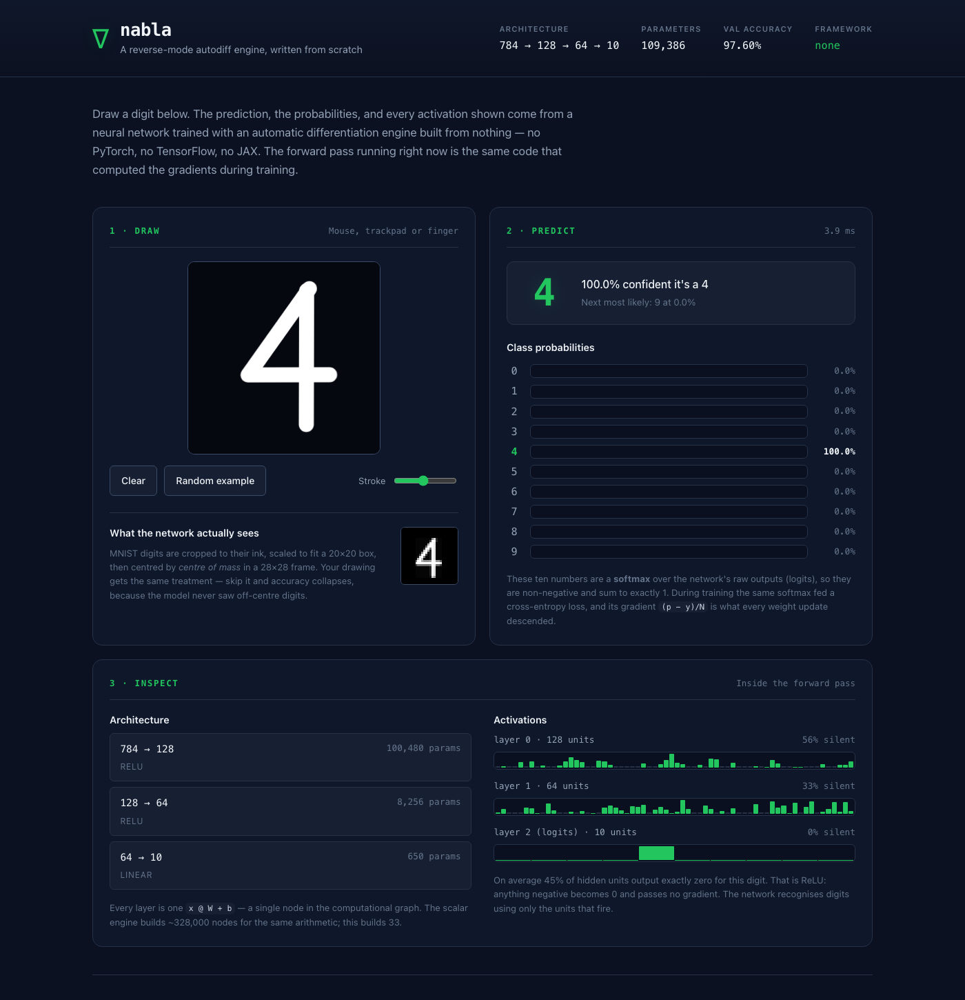

# The interactive demo



Draw a digit, watch our own engine recognise it.

```bash
python examples/train_mnist.py    # if you have no checkpoint yet
python web/server.py              # then open http://127.0.0.1:8000
```

Add `?demo` to the URL to have it draw an example itself — useful for
screenshots, and for checking the whole pipeline works without a mouse.

---

## What it shows

**1 · Draw** — a canvas, plus the 28×28 image the network actually receives.

**2 · Predict** — the winning digit, its confidence, and the full ten-class
softmax distribution. Every number comes from `nabla`.

**3 · Inspect** — the layer-by-layer architecture, and the live activations of
each layer for the digit you drew, including what fraction of units are
outputting exactly zero.

That last number is worth watching. On a typical digit, **roughly half of the
first hidden layer's 128 units output exactly zero.** That is ReLU: everything
negative becomes 0 and passes no gradient. The network recognises digits using
only the units that fire, and which half fires changes with the input. Seeing
that live makes "sparse representation" concrete in a way a paragraph does not.

## The preprocessing, which is the part that matters

The most common reason a home-made digit demo predicts badly is that it feeds
the network a naive downscale of the canvas. MNIST was not built that way. Each
digit in the dataset was:

1. cropped to its ink,
2. scaled so its longest side fits a **20×20** box, preserving aspect ratio,
3. placed in a 28×28 frame with its **centre of mass** on the centre pixel.

A network trained on that distribution has never seen a digit that fills the
frame, sits in a corner, or is stretched. Feed it one and you are handing it
out-of-distribution input — it will answer confidently and wrongly, and the
model will look broken when the *preprocessing* is broken.

`web/static/app.js` replicates all three steps (`toGrid`). The small preview
panel shows the result, so you can see exactly what the network sees. It uses a
box filter rather than nearest-neighbour downsampling, because
nearest-neighbour drops thin strokes entirely.

## Architecture

```
  browser                          server                      engine
  ───────                          ──────                      ──────
  canvas  ──784 floats in [0,1]──▶ validate  ──────────────▶  TensorMLP
                                   (784, finite, in range)     forward pass
  bars   ◀──probabilities, ────── softmax + per-layer    ◀──  log_softmax
           activations, timing     activation stats
```

**`web/server.py`** — Python standard library only, no web framework. Four
endpoints:

| method | path | returns |
|---|---|---|
| `GET` | `/api/health` | `{"status": "ok"}` |
| `GET` | `/api/model` | architecture, parameter counts, checkpoint info |
| `POST` | `/api/predict` | prediction, probabilities, logits, activations |
| `GET` | `/*` | static files from `web/static/` |

**`web/static/`** — one HTML file, one stylesheet, one script. No build step, no
`node_modules`, no bundler.

### Why no React, and why no Flask

Both were genuinely considered. The deciding argument is the same in each case:
this repository's value is that you can read all of it, and `git clone && python
web/server.py` works with nothing installed beyond the NumPy the engine already
needed.

- **Flask/FastAPI** would add a dependency and a deployment story to save about
  forty lines of routing. `http.server` covers four endpoints completely.
- **React/Vite/TypeScript** would add `node_modules`, a build step, and a second
  toolchain to keep working — in a repository that is otherwise pure Python — to
  render one canvas and ten bars. The state here is a canvas and a JSON
  response; that does not need a virtual DOM.

The honest cost: `http.server` is explicitly **not** production-hardened. It
binds to `127.0.0.1` by default and prints a warning if you change `--host`.
Exposing this publicly would need a real WSGI/ASGI server in front.

## Security

This is the only network-facing code in the repository, so it gets the only
threat model. All of the following are covered by `tests/test_web.py`:

| concern | mitigation |
|---|---|
| Remote access | Binds `127.0.0.1` only; warns when `--host` changes it |
| Memory exhaustion | Bodies capped at 256 KB, refused on the `Content-Length` header **before** any read — never size an allocation from a number the client chose |
| Malformed input | Exactly 784 finite floats in `[0, 1]`; anything else is a 400 with a reason |
| NaN poisoning | Rejected at the boundary. NaN propagates through every matmul and returns ten NaN probabilities, which looks like the *engine* failed |
| Path traversal | Static paths resolved and checked against `web/static/`; `..`, absolute paths and escaping symlinks all 403. Tested over a raw socket, since urllib and curl normalise `..` client-side and would make the test vacuous |
| MIME sniffing | `X-Content-Type-Options: nosniff` |
| Cross-origin abuse | No CORS header, deliberately — a wildcard would let any page on the internet drive a locally-running model |
| Information leak | Exceptions are logged server-side; the client gets a generic 500 |

No user input reaches the filesystem, a shell, or `eval`. The only thing a
request body ever becomes is a NumPy array.

## Accessibility

- Semantic landmarks, a skip link, and a logical heading hierarchy
- The prediction region is `aria-live="polite"`, so a screen reader announces
  results without stealing focus
- The canvas is focusable: <kbd>Enter</kbd> draws an example,
  <kbd>Esc</kbd> clears
- Visible focus rings on every control; all targets ≥ 44 px
- The winning class is marked by **weight and colour together**, never colour
  alone
- `prefers-reduced-motion` is respected
- Layout works down to 375 px

## Files

```
web/
├── server.py           API + static serving, stdlib only
├── README.md           this file
└── static/
    ├── index.html      structure and copy
    ├── style.css       dark theme, responsive, reduced-motion aware
    └── app.js          canvas, MNIST preprocessing, rendering
```
